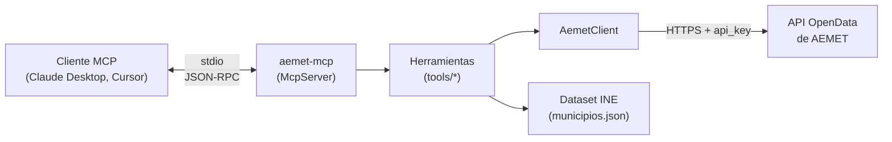
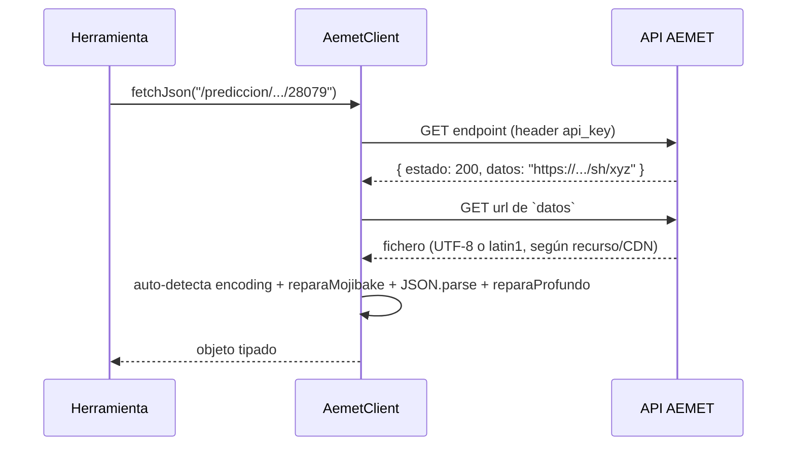
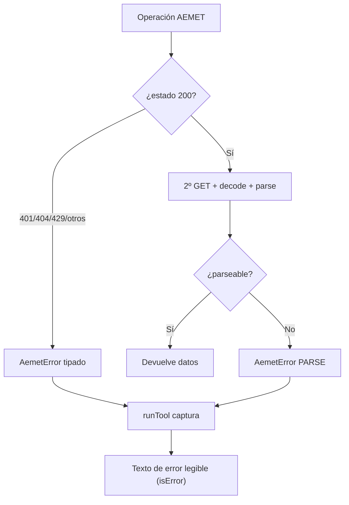
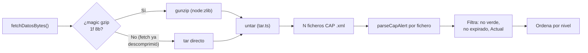

# Arquitectura técnica

Documento de referencia técnica de aemet-mcp: estructura, flujos de datos y
decisiones de implementación. Para el porqué de cada decisión, ver los
[ADR](./adr/README.md).

## 1. Visión general

aemet-mcp es un proceso Node.js de vida corta que habla el **protocolo MCP por
stdio**. Registra herramientas en un `McpServer` y traduce cada invocación en una o
más llamadas a la API de AEMET, devolviendo texto formateado.



## 2. Estructura de carpetas

```
src/
  index.ts            Entrypoint: crea McpServer, registra tools, conecta stdio
  aemet/
    client.ts         AemetClient: dos pasos, encoding auto+mojibake, estado, reintentos
    cache.ts          TtlCache: caché en memoria con TTL
    errors.ts         AemetError + mapeo de estados a mensajes
    municipios.ts     Resolver nombre → código INE (dataset bundleado)
    estaciones.ts     Resolver estación (idema o nombre) vía inventario
    areas.ts          Códigos de área CAP de las 19 CCAA (verificados)
    avisos.ts         Descompresión + parseo CAP + filtrado de avisos
    tar.ts            Extractor de tar mínimo (sin dependencias)
    format.ts         Formateadores a texto legible
    types.ts          Tipos de las respuestas de AEMET
  tools/
    municipio.ts      buscar_municipio
    prediccion.ts     prediccion_diaria, prediccion_horaria
    observacion.ts    observacion_estacion
    avisos.ts         avisos
    shared.ts         GetClient + runTool (manejo de errores)
  data/
    municipios.json   Dataset INE (8132 municipios) bundleado
scripts/
  generate-municipios.mjs   Regenera municipios.json del diccionario del INE
test/                 Suite de Vitest (unit + integración real)
```

## 3. El patrón de dos pasos de AEMET

La particularidad central de la API: la primera respuesta **no** trae los datos,
sino un sobre JSON con una URL a la que hay que volver a hacer GET.



Puntos clave encapsulados en `AemetClient`:

- **Cabecera** `api_key: <KEY>` en ambos saltos.
- **Encoding inconsistente**: AEMET mezcla UTF-8 y latin1 según el recurso/nodo CDN
  (y a veces declara `charset` erróneo → mojibake). El cliente **auto-detecta**
  (UTF-8 estricto → latin1) y **repara mojibake** (`reparaMojibake` /
  `reparaProfundo`); el sobre de error se decodifica en latin1. Ver
  [ADR-0012](./adr/0012-codificacion-autodetectada-mojibake.md).
- **Mapeo de estado** (`estado` del sobre, o el status HTTP si no hay sobre):
  `200` OK · `401` → `UNAUTHORIZED` · `404` → `NOT_FOUND` · `429` → `RATE_LIMITED`
  · resto → `UPSTREAM`.
- **Reintentos con backoff exponencial** ante `429`, fallos de red (fetch lanza) y
  `5xx` transitorios del servidor de datos.
- **Caché** por `path` con TTL.

## 4. Manejo de errores



`AemetError` lleva un `code` (`MISSING_API_KEY`, `UNAUTHORIZED`, `NOT_FOUND`,
`RATE_LIMITED`, `UPSTREAM`, `NETWORK`, `PARSE`) y, cuando aplica, el `status`. El
wrapper `runTool` (en `tools/shared.ts`) traduce cualquier excepción a un resultado
MCP con `isError: true` y texto claro, para que el modelo lo entienda en vez de ver
un fallo opaco.

## 5. Resolución de municipios

- El dataset `municipios.json` (8132 entradas `{ codigo, nombre }`) se genera del
  diccionario oficial del INE (`scripts/generate-municipios.mjs`). El código INE =
  `CPRO` (provincia, 2 díg.) + `CMUN` (municipio, 3 díg.).
- En carga se precomputa un índice normalizado (sin acentos, minúsculas).
- `resolverMunicipio` acepta código de 5 dígitos (directo) o nombre (match con
  desambiguación: si hay varias coincidencias, lanza error con las opciones).

## 6. Avisos (CAP)

El endpoint de avisos es el más complejo: devuelve un **tar.gz de ficheros XML** en
formato [CAP](https://en.wikipedia.org/wiki/Common_Alerting_Protocol).



Detalles:

- **Descompresión**: se comprueba el _magic number_ gzip. Node (undici) suele
  auto-descomprimir por `Content-Encoding`, dejando un tar plano; se soportan ambos
  casos.
- **untar propio** (`tar.ts`): recorre bloques de 512 bytes, lee nombre y tamaño
  (octal) de la cabecera y extrae los ficheros regulares. Sin dependencias.
- **Parseo CAP** (`avisos.ts`): extrae el bloque `<info>` en `es-ES` con regex
  acotadas, lee `nivel`/`fenomeno`/`probabilidad` de los `<parameter>` y `onset`/
  `expires`/`areaDesc`/`description`. Se filtran verdes, expirados y no-`Actual`.
- **Códigos de área**: los 19 códigos de CCAA (`areas.ts`) se **verificaron
  empíricamente** contra la API (van en orden alfabético; ver [ADR-0008](./adr/0008-codigos-area-avisos.md)).

## 7. Caché

`TtlCache` es un `Map<string, { value, expiresAt }>`:

- No cachea errores (una factory que lanza no envenena la entrada).
- TTL por dominio: predicción/avisos ~10 min, observación ~5 min, inventario 24 h.
- Es por proceso; al ser un servidor stdio de vida corta, basta y evita dependencias.

## 8. Build y distribución

- **tsup** empaqueta `src/index.ts` a un único ESM (`dist/index.js`) con shebang,
  bundleando el JSON de municipios. Target Node 20. El paquete es ESM-only:
  no se publica build CJS.
- **Geografía**: el dataset del INE solo trae código y nombre. La provincia se
  deriva de los dos primeros dígitos del código (tabla de 52 entradas en
  `provincias.ts`) y las coordenadas se piden al maestro de municipios de AEMET,
  cacheado 24 h. Así no hay un segundo dataset que mantener.
- `bin` apunta a `dist/index.js` → `npx @rldona/aemet-mcp` arranca el servidor.
- **TypeScript strict** (`noUncheckedIndexedAccess`, `verbatimModuleSyntax`, …).

## 9. Dependencias

Mínimas por diseño (ver [ADR-0002](./adr/0002-sin-dependencias-pesadas.md)):

- Runtime: `@modelcontextprotocol/sdk`, `zod`.
- Nativas de Node: `fetch` (undici), `node:zlib` (gunzip), `TextDecoder`.
- Sin axios, sin frameworks, sin librerías de tar/XML.
- Dev: `typescript`, `tsup`, `vitest`, `@types/node`.

## 10. Testing

- **Unitarios** con `fetch`/`sleep` inyectados: cubren los dos saltos, encoding, cada
  código de estado, reintentos, caché, resolver de municipios, untar y parseo CAP.
- **Integración real** (guardada por `AEMET_API_KEY`): predicción de Madrid y
  avisos de Andalucía contra la API en vivo.
- **CI** en Node 20.19/22/24 (los tests de integración se saltan sin la key).
